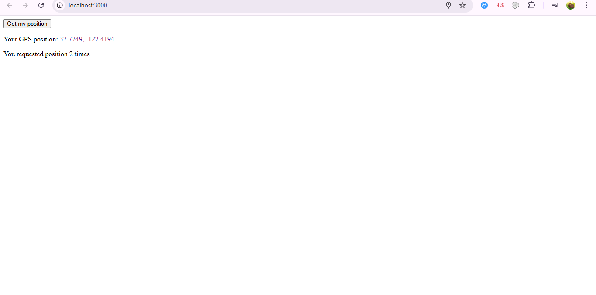
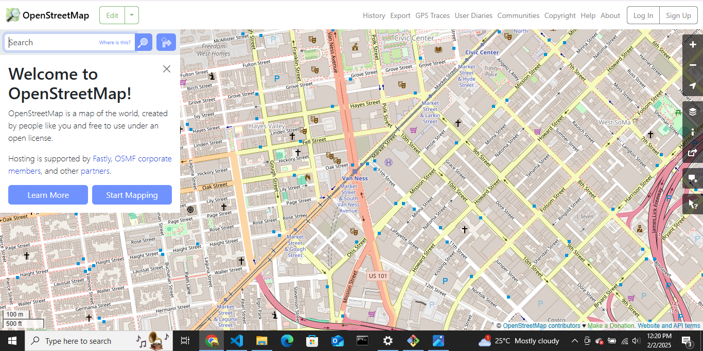

# Geolocation App 🌍  

This is a simple geolocation app built with React. It retrieves and displays the user's GPS coordinates and provides a link to view the location on OpenStreetMap.  

## 🚀 Features  
- Fetches user's geolocation coordinates  
- Displays latitude and longitude  
- Provides a link to OpenStreetMap  
- Tracks the number of times location has been requested  

## 🖼️ Screenshots  
### App Interface  
  

### Displaying GPS Coordinates  
  

## 📦 Installation  
1. Clone the repository:  
   ```sh
   git clone https://github.com/Zakyboss/geolocation-app.git
Navigate to the project folder:
sh
Copy
Edit
cd geolocation-app
Install dependencies:
sh
Copy
Edit
npm install
Start the development server:
sh
Copy
Edit
npm start
🔧 Usage
Click the "Get my position" button to retrieve your location.
Your coordinates will be displayed along with a link to OpenStreetMap.
The app will also count how many times you've requested the location.
🛠️ Technologies Used
React
JavaScript
OpenStreetMap
📜 License
This project is licensed under the MIT License.

💻 Developed by Zakariya Mohamed

markdown
Copy
Edit
